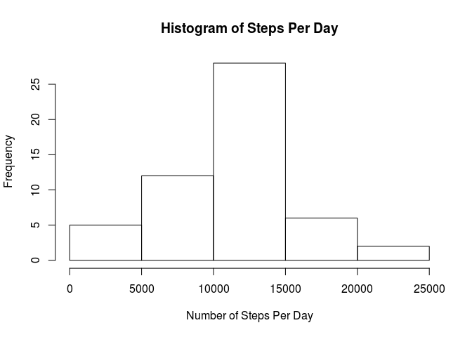
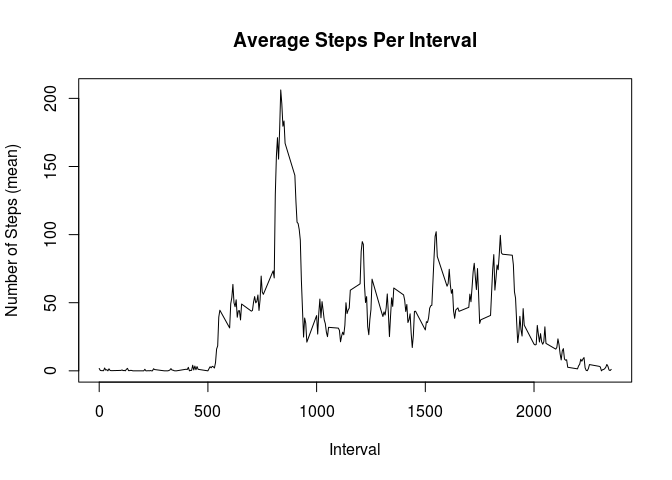
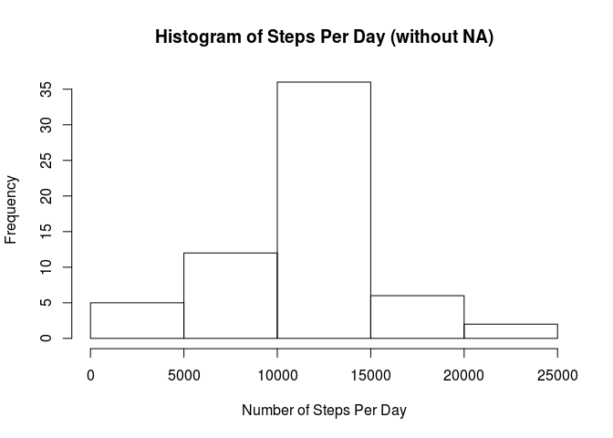
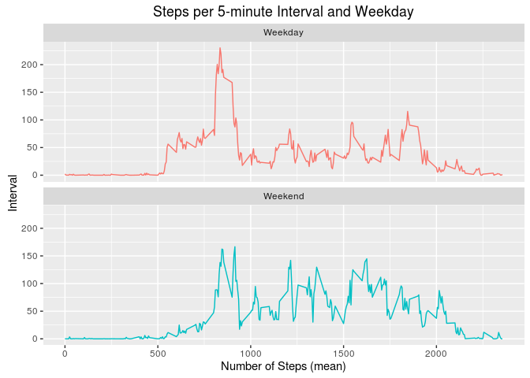

# Reproducible Research: Peer Assessment 1

We'll analyze briefly the Activity monitoring data that contains the number of steps an anonymous person 
made in every 5 minute interval during October and November 2012

The data is stored here:
https://d396qusza40orc.cloudfront.net/repdata%2Fdata%2Factivity.zip
(Last accessed: 2016-04-02)


## Loading and preprocessing the data

We need the ggplot2 library to make 1 graph. We also need to download the data and unzip it.


```r
library (ggplot2)

## Downloading, unzipping
if(!file.exists("repdata_data_activity.zip")) {download.file("https://d396qusza40orc.cloudfront.net/repdata%2Fdata%2Factivity.zip","repdata_data_activity.zip")}

## Reading data
if(!exists("activity")) {activity <- read.csv("activity.csv")}
activity$date <- as.Date(as.character(activity$date), "%Y-%m-%d")
```


## What is mean total number of steps taken per day?

The mean number of steps is 10770 (if we ignore the missing values).


```r
## Steps per day
steps_per_day <- aggregate(activity$steps, by=list(activity$date), sum)
colnames(steps_per_day) <- c('date', 'steps')
steps_per_day <- steps_per_day[complete.cases(steps_per_day),]

hist(steps_per_day$steps, main="Histogram of Steps Per Day", xlab="Number of Steps Per Day")
```



```r
dev.copy(png, "steps_per_day.png")
```

```
## png 
##   3
```

```r
dev.off()
```

```
## png 
##   2
```

```r
su <- summary(steps_per_day$steps)

mean <- su["Mean"]
median <- su["Median"]
print(paste("Steps per day - Mean: ", mean, " | Median: ", median))
```

```
## [1] "Steps per day - Mean:  10770  | Median:  10760"
```


## What is the average daily activity pattern?

The daily pattern has one height per day, at morning.
The 5-minute interval #835 has the record of the maximum activity per day.


```r
## Steps per interval
steps_per_interval <- aggregate(activity$steps, by=list(activity$interval), mean, na.rm=TRUE)
colnames(steps_per_interval) <- c('interval', 'steps')
plot(steps_per_interval$interval, steps_per_interval$steps, type="l", xlab="Interval", ylab="Number of Steps (mean)", main="Average Steps Per Interval")
```



```r
dev.copy(png, "steps_per_interval.png")
```

```
## png 
##   3
```

```r
dev.off()
```

```
## png 
##   2
```

```r
max_activity_5min_interval <- steps_per_interval[which.max(steps_per_interval[,2]),1]
print(paste("5-minute Interval with maximum activity: ", max_activity_5min_interval))
```

```
## [1] "5-minute Interval with maximum activity:  835"
```


## Imputing missing values

For filling the 2304 missing values (of 17,568 rows) I used the mean value calculated in the preceding code chunk: Steps per interval 

The mean is 

Do these values differ from the estimates from the first part of the assignment? 

The mean keeps the same, because I used the mean to fill the NA values; and the median differ slightly by less than 1%.


What is the impact of imputing missing data on the estimates of the total daily number of steps?


```r
## Filling missing values
rows_with_na <- sum(is.na(activity$steps))
print(paste("Rows with missing values: ", rows_with_na))
```

```
## [1] "Rows with missing values:  2304"
```

```r
activity_steps_na <- activity[is.na(activity$steps),]
activity_steps_not_na  <- activity[!is.na(activity$steps),]

activity_steps_na_filled <- merge(activity_steps_na, steps_per_interval, by="interval")
activity_steps_na_filled <- activity_steps_na_filled[c("steps.y", "date", "interval")]
colnames(activity_steps_na_filled) <- c("steps","date","interval")
activity_without_na <- rbind(activity_steps_na_filled, activity_steps_not_na)

## Recalculating Steps per day
steps_per_day_w_na <- aggregate(activity_without_na$steps, by=list(activity_without_na$date), sum)
colnames(steps_per_day_w_na) <- c('date', 'steps')
steps_per_day_w_na <- steps_per_day_w_na[complete.cases(steps_per_day_w_na),]

hist(steps_per_day_w_na$steps, main="Histogram of Steps Per Day (without NA)", xlab="Number of Steps Per Day")
```



```r
dev.copy(png, "steps_per_day_without_na.png")
```

```
## png 
##   3
```

```r
dev.off()
```

```
## png 
##   2
```

```r
su_w_na <- summary(steps_per_day_w_na$steps)

mean_w_na <- su_w_na["Mean"]
median_w_na <- su_w_na["Median"]
print(paste("Steps per day (without NA) - Mean: ", mean_w_na, " | Median: ", median_w_na))
```

```
## [1] "Steps per day (without NA) - Mean:  10770  | Median:  10770"
```


## Are there differences in activity patterns between weekdays and weekends?


```r
## Finding if is weekday / weekend
Sys.setlocale("LC_TIME", "en_US.UTF-8")
```

```
## [1] "en_US.UTF-8"
```

```r
activity_without_na$weekday <- weekdays.Date(activity_without_na$date)
activity_without_na$is_weekend <- (activity_without_na$weekday %in% c('Saturday','Sunday'))


## Steps per interval and weekday
steps_per_interval_weekday <- aggregate(activity_without_na$steps, by=list(activity_without_na$interval, activity_without_na$is_weekend), mean)
colnames(steps_per_interval_weekday) <- c('interval', 'is_weekend', 'steps')

ggp <- ggplot(data = steps_per_interval_weekday, aes(x=interval, y=steps, color=is_weekend)) +     
    ggtitle("Steps per 5-minute Interval and Weekday") + 
    ylab("Interval") +
    xlab("Number of Steps (mean)") +
    geom_line() +
    facet_wrap(~ is_weekend, nrow=2, labeller = as_labeller(c("FALSE" = "Weekday", "TRUE" = "Weekend"))) +
    scale_colour_discrete(guide = FALSE)

print(ggp)
```



```r
ggsave(file="steps_per_interval_weekday.png")
```

```
## Saving 7 x 5 in image
```
