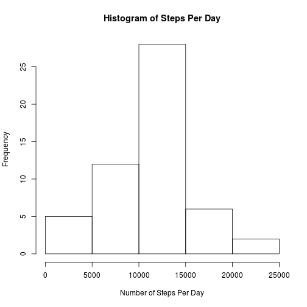
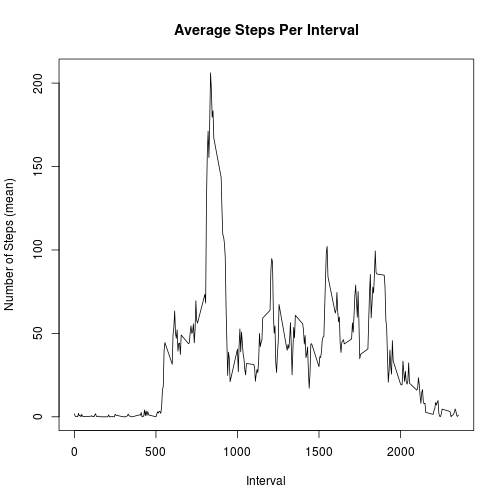
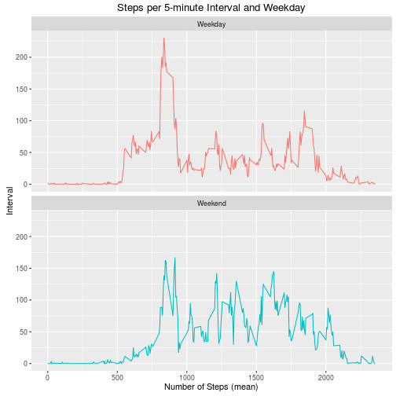

<!-- rmarkdown v1 -->
---
title: "Reproducible Research: Peer Assessment 1"
output: 
  html_document:
    keep_md: true
---

We'll analyze briefly the Activity monitoring data that contains the number of steps an anonymous person 
made in every 5 minute interval during October and November 2012

The data is stored here:
https://d396qusza40orc.cloudfront.net/repdata%2Fdata%2Factivity.zip
(Last accessed: 2016-04-02)


## Loading and preprocessing the data

We need the ggplot2 library to make 1 graph. We also need to download the data and unzip it.


```r
library (ggplot2)

## Downloading, unzipping
if(!file.exists("repdata_data_activity.zip")) {download.file("https://d396qusza40orc.cloudfront.net/repdata%2Fdata%2Factivity.zip","repdata_data_activity.zip")}

## Reading data
if(!exists("activity")) {activity <- read.csv("activity.csv")}
activity$date <- as.Date(as.character(activity$date), "%Y-%m-%d")
```


## What is mean total number of steps taken per day?

The mean number of steps is 10770 (if we ignore the missing values).


```r
## Steps per day
steps_per_day <- aggregate(activity$steps, by=list(activity$date), sum)
colnames(steps_per_day) <- c('date', 'steps')
steps_per_day <- steps_per_day[complete.cases(steps_per_day),]

hist(steps_per_day$steps, main="Histogram of Steps Per Day", xlab="Number of Steps Per Day")
```



```r
dev.copy(png, "steps_per_day.png")
```

```
## png 
##   3
```

```r
dev.off()
```

```
## png 
##   2
```

```r
su <- summary(steps_per_day$steps)

mean <- su["Mean"]
median <- su["Median"]
print(paste("Steps per day - Mean: ", mean, " | Median: ", median))
```

```
## [1] "Steps per day - Mean:  10770  | Median:  10760"
```


## What is the average daily activity pattern?

The daily pattern has one height per day, at morning.
The 5-minute interval #835 has the record of the maximum activity per day.


```r
## Steps per interval
steps_per_interval <- aggregate(activity$steps, by=list(activity$interval), mean, na.rm=TRUE)
colnames(steps_per_interval) <- c('interval', 'steps')
plot(steps_per_interval$interval, steps_per_interval$steps, type="l", xlab="Interval", ylab="Number of Steps (mean)", main="Average Steps Per Interval")
```



```r
dev.copy(png, "steps_per_interval.png")
```

```
## png 
##   3
```

```r
dev.off()
```

```
## png 
##   2
```

```r
max_activity_5min_interval <- steps_per_interval[which.max(steps_per_interval[,2]),1]
print(paste("5-minute Interval with maximum activity: ", max_activity_5min_interval))
```

```
## [1] "5-minute Interval with maximum activity:  835"
```


## Imputing missing values

For filling the 2304 missing values (of 17,568 rows) I used the mean value calculated in the preceding code chunk: Steps per interval 

The mean keeps being 10,770 and the median goes up by little to 10,770 

Do these values differ from the estimates from the first part of the assignment? 

The mean keeps the same, because I used the mean to fill the NA values; and the median differ slightly by less than 1%.


What is the impact of imputing missing data on the estimates of the total daily number of steps?

There average number of steps taken per day increased. 


```r
## Filling missing values
rows_with_na <- sum(is.na(activity$steps))
print(paste("Rows with missing values: ", rows_with_na))
```

```
## [1] "Rows with missing values:  2304"
```

```r
activity_steps_na <- activity[is.na(activity$steps),]
activity_steps_not_na  <- activity[!is.na(activity$steps),]

activity_steps_na_filled <- merge(activity_steps_na, steps_per_interval, by="interval")
activity_steps_na_filled <- activity_steps_na_filled[c("steps.y", "date", "interval")]
colnames(activity_steps_na_filled) <- c("steps","date","interval")
activity_without_na <- rbind(activity_steps_na_filled, activity_steps_not_na)

## Recalculating Steps per day
steps_per_day_w_na <- aggregate(activity_without_na$steps, by=list(activity_without_na$date), sum)
colnames(steps_per_day_w_na) <- c('date', 'steps')
steps_per_day_w_na <- steps_per_day_w_na[complete.cases(steps_per_day_w_na),]

hist(steps_per_day_w_na$steps, main="Histogram of Steps Per Day (without NA)", xlab="Number of Steps Per Day")
```


```r
dev.copy(png, "steps_per_day_without_na.png")
```

```
## png 
##   3
```

```r
dev.off()
```

```
## png 
##   2
```

```r
su_w_na <- summary(steps_per_day_w_na$steps)

mean_w_na <- su_w_na["Mean"]
median_w_na <- su_w_na["Median"]
print(paste("Steps per day (without NA) - Mean: ", mean_w_na, " | Median: ", median_w_na))
```

```
## [1] "Steps per day (without NA) - Mean:  10770  | Median:  10770"
```


## Are there differences in activity patterns between weekdays and weekends?

Yes. There is more activity during weekday's mornings, but the overall weekend's activity is higher and it lasts till higher hours.   


```r
## Finding if is weekday / weekend
Sys.setlocale("LC_TIME", "en_US.UTF-8")
```

```
## [1] "en_US.UTF-8"
```

```r
activity_without_na$weekday <- weekdays.Date(activity_without_na$date)
activity_without_na$is_weekend <- (activity_without_na$weekday %in% c('Saturday','Sunday'))


## Steps per interval and weekday
steps_per_interval_weekday <- aggregate(activity_without_na$steps, by=list(activity_without_na$interval, activity_without_na$is_weekend), mean)
colnames(steps_per_interval_weekday) <- c('interval', 'is_weekend', 'steps')

ggp <- ggplot(data = steps_per_interval_weekday, aes(x=interval, y=steps, color=is_weekend)) +     
    ggtitle("Steps per 5-minute Interval and Weekday") + 
    ylab("Interval") +
    xlab("Number of Steps (mean)") +
    geom_line() +
    facet_wrap(~ is_weekend, nrow=2, labeller = as_labeller(c("FALSE" = "Weekday", "TRUE" = "Weekend"))) +
    scale_colour_discrete(guide = FALSE)

print(ggp)
```



```r
ggsave(file="steps_per_interval_weekday.png")
```

```
## Saving 7 x 7 in image
```
